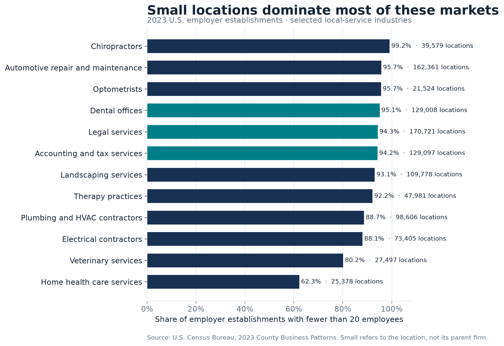
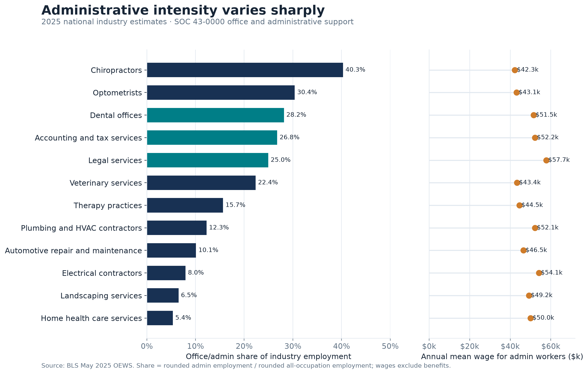
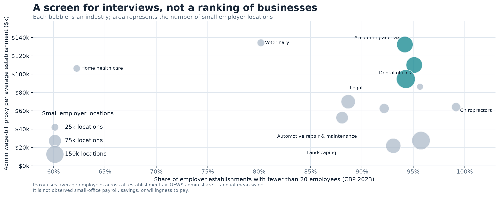

# Before You Build Another AI SaaS: Which Local-Service Markets Are Worth Interviewing?

*Working draft for team review; verify figures and interpretation before publication.*

*A public-data screen for founders deciding where to do customer discovery—not a verdict on what to build.*

A founder can spend months pursuing a market because one practice owner described a frustrating workflow. That conversation matters, but it does not reveal how many similar organizations exist or how the work is staffed across an industry. We built a screen for an earlier decision: **which local-service industries merit interviews first?** It is for founders and researchers who want a defensible starting point before choosing a product.

We compared 12 selected U.S. service industries using two public measures. The [Census Bureau's 2023 County Business Patterns (CBP)](https://www.census.gov/data/datasets/2023/econ/cbp/2023-cbp.html) gives employer-establishment counts and employment-size bands. The [Bureau of Labor Statistics' May 2025 Occupational Employment and Wage Statistics (OEWS)](https://www.bls.gov/oes/2025/may/oessrci.htm) gives industry-specific employment and wages for office and administrative support occupations. Together, they show where small establishments are numerous and where office/admin work is a meaningful part of employment. Neither source measures customer pain or software demand.

## First, how many small establishments are there?

An establishment is a place of business, not necessarily an independent company. We define “small” as fewer than 20 employees: the CBP counts for fewer than 5, 5–9, and 10–19 employees added together. The first chart shows the share of each industry's establishments below that threshold.

The pattern is not just “healthcare is fragmented” or “trades are fragmented.” It varies sharply within those broad labels. **Chiropractors are 99.2% small establishments**, while **home health care services are 62.3%**. Dental offices are **95.1%** small: **129,008 of 135,665** employer establishments had fewer than 20 employees in 2023. But a high percentage can hide a shallow market. Optometrists are also highly fragmented at **95.7%**, yet the selected industry contains about **21,500** small establishments nationally, compared with about **171,000** in legal services.

This does not prove these workplaces are owner-operated or independently owned. It says how their **employer establishments** are distributed by employment size.

## Then, is office work a meaningful part of employment?

If the only question were “where are there many small workplaces?”, we would miss a second dimension: how an industry's labor is organized. The next chart compares the share of OEWS employment in the office and administrative support occupational group (SOC 43-0000), with the group's annual mean wage shown for context.

The selected industries span a wide range. Office/admin support accounts for about **40.3%** of OEWS employment in chiropractors, **30.4%** in optometrists, **28.2%** in dental offices, **26.8%** in accounting and tax services, and **25.0%** in legal services. At the other end, it is about **5.4%** in home health care services and **6.5%** in landscaping. These are occupational shares, not measures of inefficiency. A receptionist or bookkeeper may be doing essential, high-value work that technology should support rather than replace.

The sharper contrast is **automotive repair and dental offices**. Both have more than 125,000 small employer establishments and roughly 95% of locations below 20 employees, but office/admin workers account for **10.1%** of employment in automotive repair and **28.2%** in dental offices. Counting establishments alone would miss that occupational difference.

## The market screen: a reason to ask questions, not to declare a winner

We combined the dimensions in a bubble chart. Moving right means a larger share of establishments have fewer than 20 employees. Moving up means a higher **estimated office/admin wage-payroll proxy per establishment**. Bubble area represents the number of small establishments. The upper-right, larger bubbles are candidates for *deeper investigation*, not proven business opportunities.

| Industry | Small establishments | Share under 20 | Office/admin employment share | Estimated wage-payroll proxy per establishment |
|---|---:|---:|---:|---:|
| Accounting and tax services | 129,097 | 94.2% | 26.8% | $132,000 |
| Dental offices | 129,008 | 95.1% | 28.2% | $110,000 |
| Legal services | 170,721 | 94.3% | 25.0% | $95,000 |
| Chiropractors | 39,579 | 99.2% | 40.3% | $64,000 |
| Veterinary services | 27,497 | 80.2% | 22.4% | $134,000 |

The table illustrates why we kept the axes separate rather than making one “opportunity score.” Veterinary services have the highest proxy in this selection, at about **$134,000**, but a lower small-establishment share and far fewer small establishments than dental, accounting, or legal services. Chiropractors have the highest small-establishment and office/admin shares, yet a smaller estimated wage-payroll proxy per establishment. The comparison is informative precisely because it does **not** collapse those tradeoffs into one rank.

### How the estimate works

For each industry, we divided CBP employment by CBP establishments to get average employees per establishment. We multiplied that average by the OEWS office/admin employment share and the OEWS annual mean wage for that occupational group. For example, the dental-office calculation is approximately **7.6 employees × 28.2% × $51,480 = $110,000**.

This is a **constructed, directional proxy**, not an observed payroll figure for a typical office. The chart's horizontal position and bubble size describe *small* establishments, but its vertical position uses average employees across **all** establishments in that industry. It applies an industry-wide occupational mix and mean wage to that average; neither source reports the joint distribution at individual establishments. For most occupations, [BLS converts hourly wages to an annual rate using a 2,080-hour full-time year](https://www.bls.gov/opub/hom/oews/calculation.htm), which need not equal a part-time worker's actual annual pay. A firm with 3 workers and a firm with 50 are not represented by the same “typical” office. The chart should therefore prompt questions, not investment calculations.

## Four interview candidates—and the questions we would bring

The data suggest a **shortlist for customer discovery**, not a winner:

1. **Accounting and tax services:** large small-establishment count and substantial office/admin employment. How much of that work is seasonal, client-facing, or already handled by specialized software? This category includes bookkeeping and payroll services, so interviews must narrow the segment.
2. **Dental offices:** nearly the same small-establishment count as accounting and a high office/admin share. Which scheduling, billing, insurance, and patient-communication tasks are most burdensome—and which must remain human-led?
3. **Legal services:** the largest small-establishment count among these five examples. Are the workflows and buying decisions similar enough across practice types to support a focused product, or is the broad industry category concealing separate markets?
4. **Chiropractors:** extremely high small-establishment and office/admin shares. Are those roles concentrated in front-desk and billing work, and do small practices have a budget and willingness to change tools?

Veterinary services remain a useful comparison in interviews even though we would not select a “top four” by the wage-payroll proxy alone. A different founder with domain access, an existing distribution channel, or a validated pain point might reasonably prioritize it.

## What these data cannot tell us

This is a deliberately selected, national comparison—not a census of all promising markets. CBP covers **employer establishments**, not nonemployer businesses or unique firms; one company may operate many establishments. The industries mix four- and six-digit NAICS detail, and broader categories such as legal services and accounting/tax services contain different business models. The analysis pipeline checks the 2017-NAICS CBP and 2022-NAICS OEWS scopes with an official crosswalk, but the **2023 and 2025 reference years differ**, and the two programs use different data-collection methods. OEWS employment and wage figures are estimates, and the source data can contain suppression or rounding. The pipeline does not treat unavailable source values as zero.

Most importantly, administrative employment is not “waste” or a count of jobs that could—or should—be automated. It does not reveal task-level workflows, product adoption, regulatory constraints, employee experience, customer outcomes, purchasing authority, or willingness to pay. A proposed product could save time, shift work, add oversight burdens, or harm service quality; aggregate public data cannot adjudicate those outcomes. The ethical next step is to ask workers and customers what is difficult and what better support would look like, not to infer replacement potential from an occupational code.

## Takeaway

**Public data can narrow where to ask better questions. Customers must tell us what hurts, what improvement is valuable, and whether anyone would buy it.** This screen gives us four concrete interview starting points and a reproducible way to challenge our assumptions. If those interviews contradict the structural signals, we should follow the interviews.

*Sources: [U.S. Census Bureau, 2023 County Business Patterns](https://www.census.gov/data/datasets/2023/econ/cbp/2023-cbp.html); [U.S. Bureau of Labor Statistics, May 2025 National Industry-Specific OEWS](https://www.bls.gov/oes/2025/may/oessrci.htm), including its [technical notes](https://www.bls.gov/oes/2025/may/oes_tec.htm). Values are rounded for readability; calculations and selected-industry definitions are documented in the accompanying repository.*
